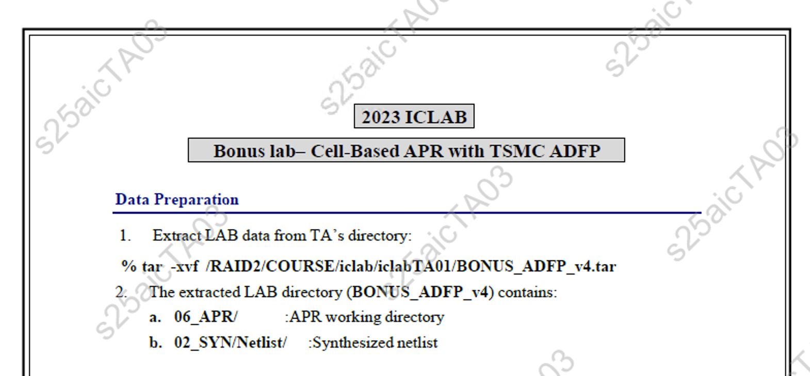

# 🖋️ PDF Watermark & Deployment Automation Tool


This Python-based automation tool enables batch watermarking of PDF documents, including timestamp overlays, and deployment to NFS folders with symbolic link creation for students and TAs. Designed for academic or enterprise environments managing bulk PDF file distribution securely and efficiently.

### ADFP 製程文件專用浮水印產生與部署系統

本工具源自於 **ADFP 製程文件管理需求**，為了保障技術資料安全，系統會自動在每份 PDF 文件中加上**使用者帳號的浮水印與日期標註**，確保所有文件皆**綁定特定學生或助教身分**，在發生截圖、翻拍等不當使用時，能夠有效追蹤來源。

> This system was developed for the **ADFP process documentation**, enabling secure tracking of each PDF document by embedding **user-specific watermark and date**. When inappropriate behavior such as screenshotting or unauthorized sharing occurs, it allows administrators to trace back to the specific user.

覺得對你有幫助嗎？歡迎在 GitHub 上點個 Star ⭐️，讓更多人看到這份資源！
Feel free to star this repository on GitHub if you find it helpful! 

[](https://github.com/lhlaib/pdf-watermark-deployer) [](https://github.com/lhlaib)

---

## 📷 範例示意 / Example




---

## 🚀 Features

- ✅ **Watermark PDF with Custom Text and Date**
- ✅ **Supports DPI Scaling, Opacity, Rotation, and Grid Spacing**
- ✅ **Parallel Processing** (Multi-core support up to 200 cores)
- ✅ **Auto PDF Output Folder Structure by User**
- ✅ **Move Processed Files to NFS Course Folder**
- ✅ **Create Symbolic Links on User Desktop**
- ✅ **Supports TA and Student ID Ranges**
- ✅ **Customizable via JSON Configuration**

## 🚀 功能介紹 / Features

- ✅ **浮水印 + 日期標記**
- ✅ **支援 DPI、透明度、角度與間距調整**
- ✅ **多核心平行處理**
- ✅ **學生與助教 ID 批次產出**
- ✅ **自動搬移至課程 NFS 目錄**
- ✅ **建立桌面捷徑與 .vscode 連結**
- ✅ **JSON 設定檔快速控制執行流程**
  
---

## 📁 Folder Structure Example

```

📂 input\_folder/  
└── report1.pdf  
└── report2.pdf  
📂 output/  
└── <term>/<course>/<user>/\*.pdf  
📂 NFS\_folder/  
└── <term>/<course>/<user>/input\_folder/  
📂 course\_folder/  
└── <term>/<course>/<user>/Desktop/

```

---

## 🛠️ Setup & Deployment

### 1. Clone Repository

```bash
git clone https://github.com/yourusername/pdf-batch-processor.git
cd pdf-batch-processor
```

### 2\. Create Python Environment (Recommended)

```bash
python3 -m venv venv
source venv/bin/activate
```

### 3\. Install Dependencies

```bash
pip install -r requirements.txt
```

```text
📝 requirements.txt contents:
fpdf
pillow
PyMuPDF
reportlab
tqdm
```

### 4\. Prepare Configuration File

Create a `config.json` using the template below (see 📋 Configuration).

* * *

📋 Sample Configuration (`config.json`)
---------------------------------------

```json
{
  "course_info": {
    "term": "2024-Fall",
    "course_name": "ICLAB",
    "TA_from": 1,
    "TA_to": 3,
    "stu_from": 1,
    "stu_to": 100
  },
  "PDF": {
    "Input Folder": "input_folder",
    "Output Folder": "output_folder",
    "NFS_folder": "/RAID2/COURSE",
    "course_folder": "/home/students",
    "watermark_text": "CONFIDENTIAL",
    "opacity": 128,
    "angle": 45,
    "spacing_width": 100,
    "spacing_height": 100,
    "font_size": 72,
    "Enable_WaterProof_PDF": true,
    "Enable_Move_PDF_To_NFS": true,
    "Enable_Create_Symbolic_Link": true,
    "Enable_Remove_from_output_folder": false,
    "Enable_Remove_from_NFS_folder": false
  }
}
```

* * *

🚀 Run the Script
-----------------

```bash
python main.py -r config.json
```

* * *

🧩 Key Functions
----------------

*   `add_watermark_to_pdf(...)`: Overlay watermark onto PDF using PyMuPDF and ReportLab.
    
*   `process_all_users_files(...)`: Batch and parallel processing for all user folders.
    
*   `move_files_to_course_folder(...)`: Move processed files to NFS folders.
    
*   `create_symbolic_link_to_user_folder(...)`: Link desktop/course resources.
    
*   `remove_files_from_output_folder(...)`: Clean local outputs.
    
*   `remove_files_from_NFS_folder(...)`: Clean course server outputs.
    

* * *

📌 Notes
--------

*   Supports up to 128-core parallel processing (adjust `DOCUMENT_CORES`).
    
*   Works best in Linux-based environments with access to `/RAID2`, course folders, and NFS mounts.
    
*   Uses ANSI terminal coloring for better log readability.
    


* * *

🧑‍💻 Author
------------

**Lin-Hung Lai (賴林鴻)**  
Ph.D. Candidate @ NYCU | Visiting Scholar @ Stanford  
Email: h123572119@gmail.com

* * *

📜 License
----------

MIT License

